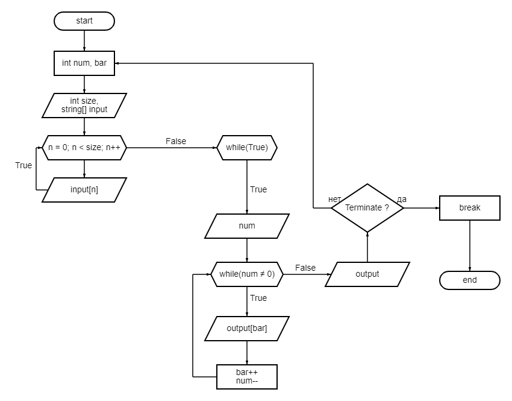

# Программа которая позволяет пользователю задать текстовый массив и создать на его основе ещё один меньшего размера.

## Блок-схема алгоритма.

## Описание работы программы.

1. Пользователь вводит размер будущего массива.
2. Создается массив.
4. Пользователь вводит текст.
5. Пользователь задает размер нового массива.
6. Пользователь вводит значения положения текста в исходномо массиве, которые будут в новом.
7. Новый массив показывается пользователю.
8. Пользователь может закончит работу программы.

## Комментарии

1. Часто повторяющиеся действия такие как вывод массива в консоль и перевод текстовых данных в числовые находятся в классе **Utils**.

2. Класс **Solution** производит большую часть работы, когда как функция **Main** используется в основном для контроля потока и проверки некторых введенных данных.

